# DIAGRAMA DE FLUJO - SISTEMA ERP BRADA SERVICES

## 1. FLUJO GENERAL DEL SISTEMA

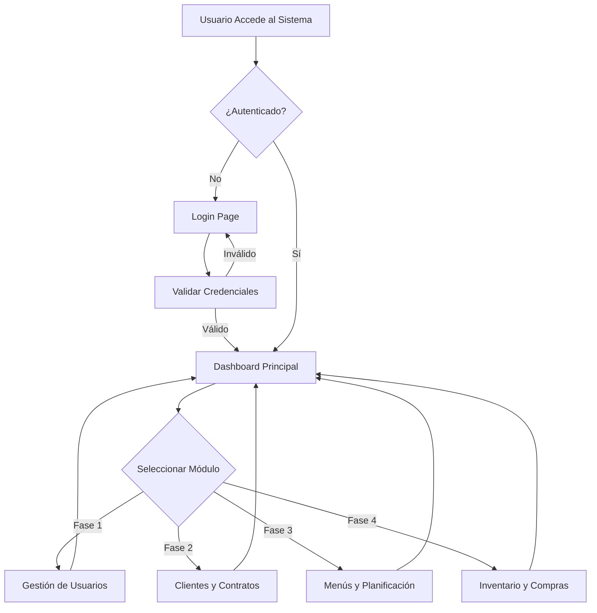

## 2. FASE 1 - FUNDACIÓN Y ACCESO

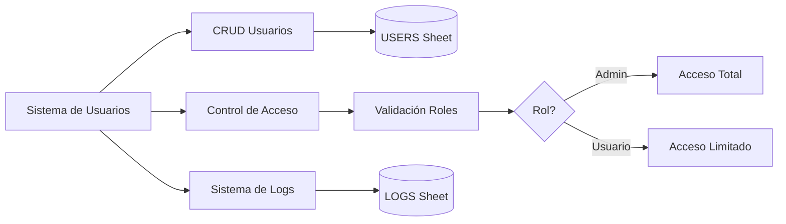

## 3. FASE 2 - CLIENTES Y CONTRATOS

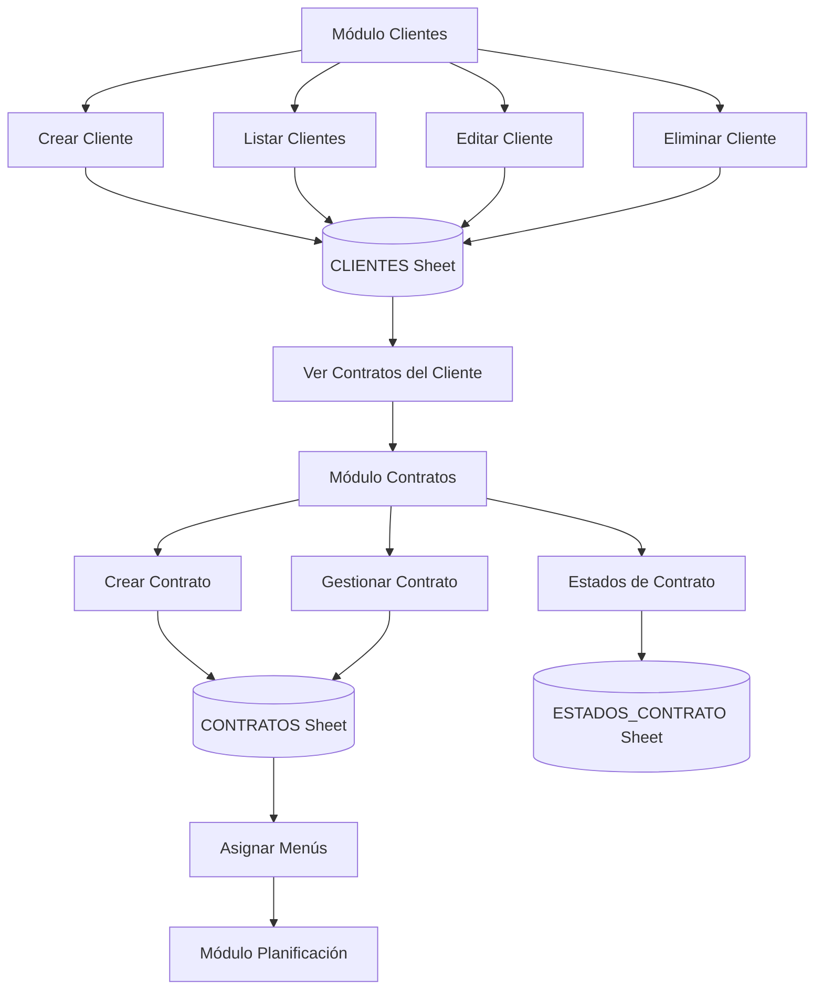

## 4. FASE 3 - MENÚS Y PLANIFICACIÓN

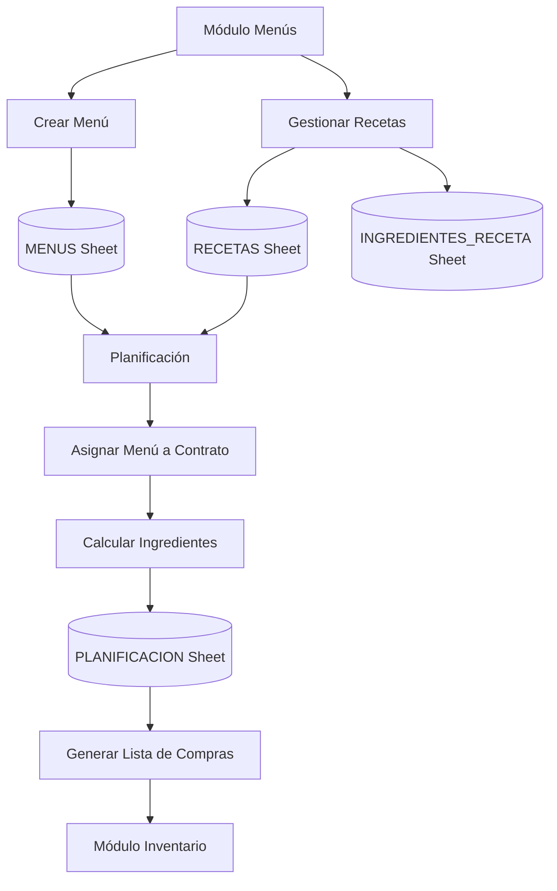

## 5. FASE 4 - INVENTARIO Y COMPRAS (Flujo Completo)

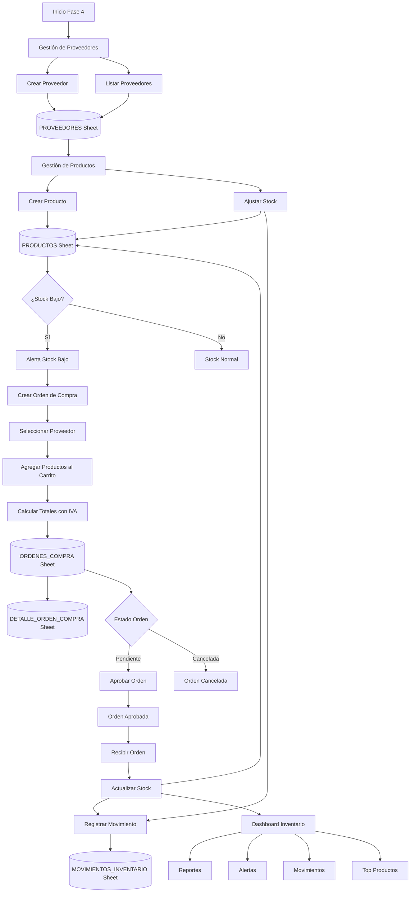

## 6. FLUJO DE ORDEN DE COMPRA (Detallado)

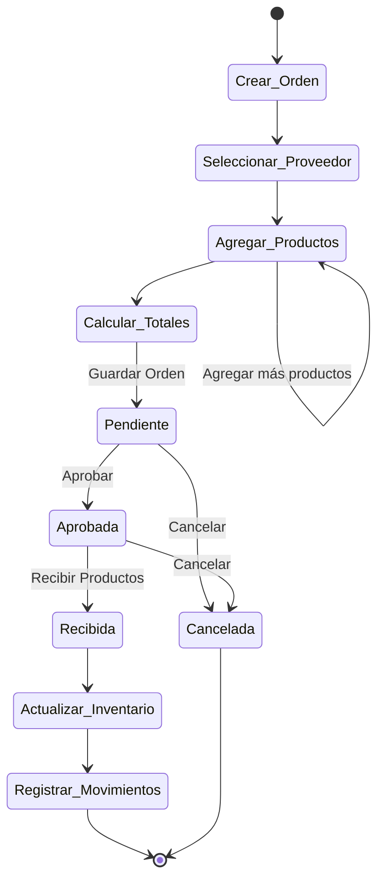

## 7. FLUJO DE MOVIMIENTOS DE INVENTARIO

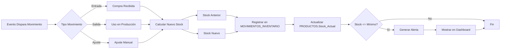

## 8. ARQUITECTURA DE DATOS

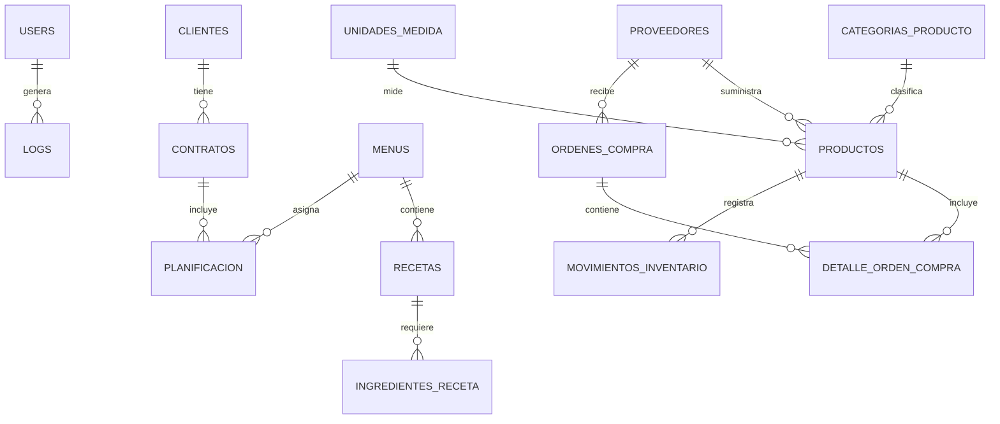

## 9. FLUJO DE NAVEGACIÓN DEL USUARIO

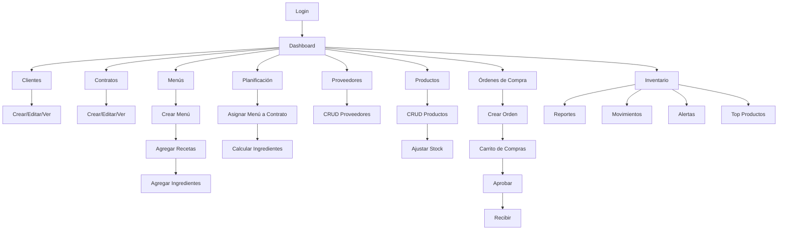

## 10. FLUJO DE CÁLCULO DE INGREDIENTES (Planificación)

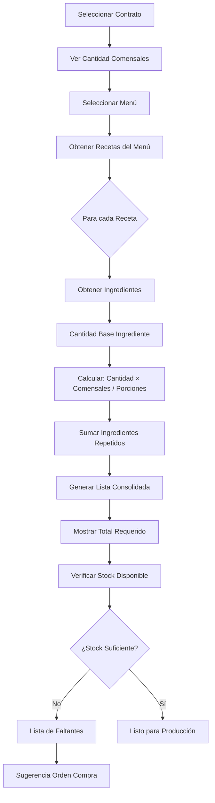

## 11. FLUJO DE AUTENTICACIÓN Y AUTORIZACIÓN

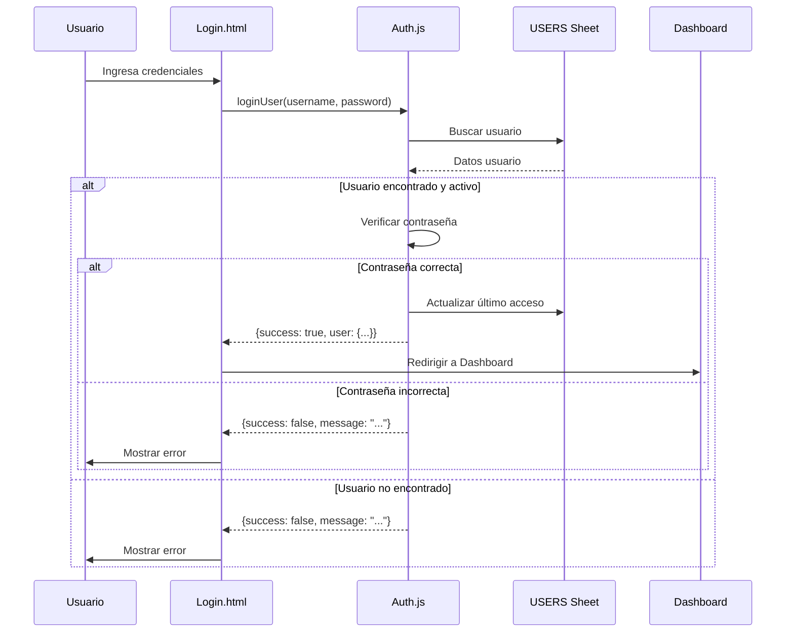

## 12. FLUJO DE CREACIÓN DE PRODUCTO CON STOCK INICIAL

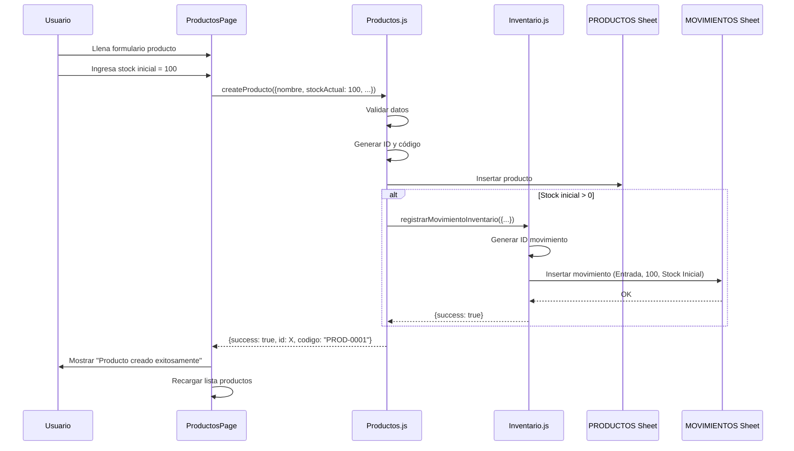

## 13. RESUMEN DE HOJAS Y SU PROPÓSITO

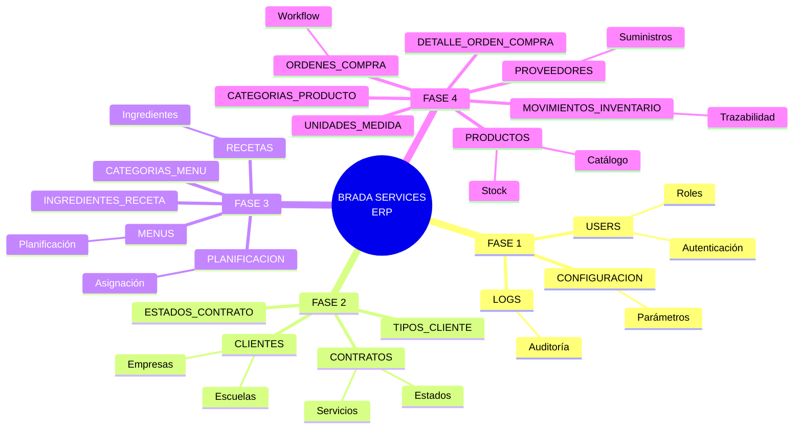

---

## NOTAS DE IMPLEMENTACIÓN

### Flujo de Estados de Orden de Compra:
1. **Pendiente** → Orden creada, esperando aprobación
2. **Aprobada** → Orden confirmada, lista para recibir
3. **Recibida** → Productos recibidos, inventario actualizado
4. **Cancelada** → Orden anulada (puede cancelarse en Pendiente o Aprobada)

### Tipos de Movimientos de Inventario:
- **Entrada**: Compras, devoluciones, ajustes positivos
- **Salida**: Uso en producción, ventas, ajustes negativos
- **Ajuste**: Correcciones manuales de inventario

### Cálculo de Totales en Orden de Compra:
```
Subtotal = Σ(Cantidad × Precio Unitario)
Impuesto = Subtotal × 18% (IVA)
Total = Subtotal + Impuesto
```

### Fórmula de Cálculo de Ingredientes:
```
Cantidad Requerida = (Cantidad Base × Comensales) / Porciones Receta
```

---

**Generado para:** Brada Services ERP System
**Versión:** Fase 4 Completa
**Fecha:** 2025-01-25
